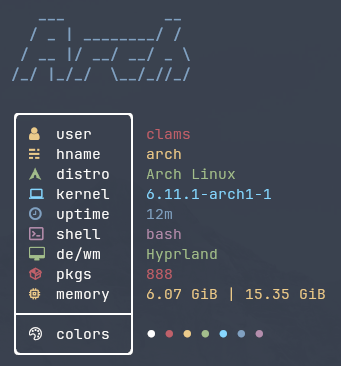

<div align="center">



</div>

<div align="center">

# nitch++

A rewrite of [`nitch`](https://github.com/ssleert/nitch) in C++ with some extra features.

*Currently takes 2 milliseconds to run on my machine.*

</div>

### Contents

- [Why?](#why)
- [Support](#support)
- [Dependencies](#dependencies)
- [Building and Installation](#building-and-installation)
- [Usage](#usage)
- [Configuration](#configuration)

### Why?

Because nitch has been unmaintained since 2022 and I think it was a neat project.

### Support

`nitch++` currently supports the following Linux distributions and macOS (mostly), although I have not been able to test all of them. If any problems arise, please create an [issue](https://github.com/clamsfeel2/nitchplusplus/issues/new).

- Ubuntu
- Arch
- EndeavourOS
- Artix
- Manjaro
- Debian
- Fedora
- RedHat
- Mint
- PopOS!
- Void
- OpenSUSE
- Gentoo
- NixOS
- Zorin
- Slackware
- CentOS

### Dependencies

> [!NOTE]
>
> *Having a [`NerdFont`](https://github.com/ryanoasis/nerd-fonts) installed on your system is required to make the icons display.*

`nitch++` relies on `g++`, `cmake`, and either `ninja` or `make` for compiling and building.

### Building and Installation

For those on Arch based systems, I have a [`PKGBUILD`](./install/PKGBUILD) available. 

For everyone else:

**Clone the repository and go into the new directory**

```sh
git clone https://github.com/clamsfeel2/nitchplusplus.git && cd nitchplusplus
```

**Create and cd into the build directory**

```sh
mkdir build && cd build
```

**Run CMake, then build the project**

```sh
cmake .. && make install
```

or with ninja

```sh
cmake -GNinja .. && ninja install
```

**To uninstall `nitch++` run**

```sh
make uninstall
```

or with ninja

```sh
ninja uninstall
```

### Usage

Just run

```sh
nitch++
```

To **not** use [`NerdFonts`](https://github.com/ryanoasis/nerd-fonts).

```sh
nitch++ --nonerd
```

To **not** display ascii art

```sh
nitch++ --noascii
```

To display ascii art of a different distro

```sh
nitch++ --distro [distro name]
```

*A list of valid distro names can be found in the [example config file](./config/example_config.toml)*

To clear the screen before nitch++ is ran

```sh
nitch++ --clear
```

Adjust the box width in the output

```sh
nitch++ --width [integer >= 6]
```

Padding adjustment for each row/column is not currently supported, making this feature more of a gimmick for now. Still fun, I think.

Output of `nitch++ --help`

```sh
-a, --noascii
     run nitch++ without displaying ascii art.

-n, --nonerd
     do not use nerd fonts.

-d, --distro [distro name]
     display ascii art of specified distro.

-w, --width [>=6]
     change the width of the output box with specified value.

-c, --clear
     clear the screen before running nitch++.
```

### Configuration

In order to use the config file, put the [example config file](./config/example_config.toml) into the config directory. By default `nitch++` will use `$XDG_CONFIG_HOME/nitch++/config.toml` as the path to your config file. However, you are able to change the path by setting `NITCHPP_CONFIG_FILE` environment variable to a path ending in `config.toml`
